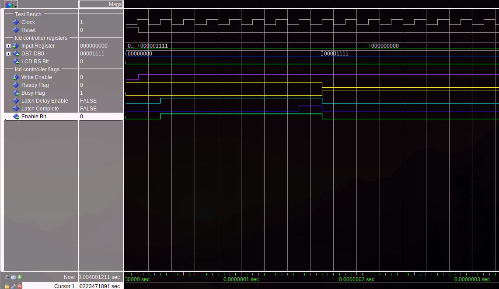
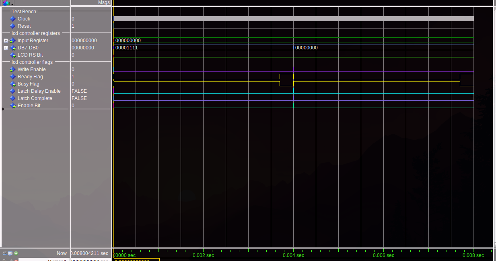

# Entity: lcd_controller 
- **File**: lcd_controller.vhd

## Diagram

## Generics

| Generic name | Type | Value | Description |
| ------------ | ---- | ----- | ----------- |
| CLK_PERIOD   | time | 20 ns |             |

## Ports

| Port name       | Direction | Type                         | Description |
| --------------- | --------- | ---------------------------- | ----------- |
| clk             | in        | std_logic                    |             |
| reset           | in        | std_logic                    |             |
| write_register  | in        | std_logic_vector(8 downto 0) |             |
| write_enable    | in        | std_logic                    |             |
| output_register | out       | std_logic_vector(7 downto 0) |             |
| rs              | out       | std_logic                    |             |
| e               | out       | std_logic                    |             |
| busy_flag       | out       | std_logic                    |             |

## Signals

| Name               | Type      | Description |
| ------------------ | --------- | ----------- |
| enable_delay       | boolean   |             |
| done_delay         | boolean   |             |
| ready_flag         | std_logic |             |
| delay_time         | integer   |             |
| enable_latch_delay | boolean   |             |
| done_latch         | boolean   |             |

## Constants

| Name                    | Type    | Value             | Description |
| ----------------------- | ------- | ----------------- | ----------- |
| CLOCK_PULSE_PER_MS      | integer | 1 ms / CLK_PERIOD |             |
| SHORT_INSTRUCTION_DELAY | integer | 185000            |             |
| LONG_INSTRUCTION_DELAY  | integer | 76000000          |             |
| ENABLE_LATCH_TIME       | integer | 5                 |             |

## Processes
- proc_lcd_write: ( clk, reset, ready_flag )

## Instantiations

- busy_timer: clock_divider
- latch_timer: clock_divider

## Test bench results

Testing was done by settings the appropriate bit pattern to turn on the LCD. The test bench then attempts to preform a second write before the write enable is set. This shows the write enable works as expected. The enable latching and instruction write lock out are also shown showing that the timing of the LCD is preserved in the hardware. 

