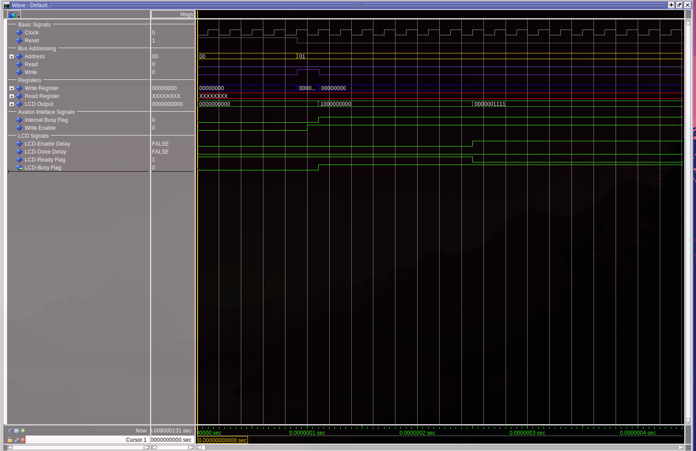
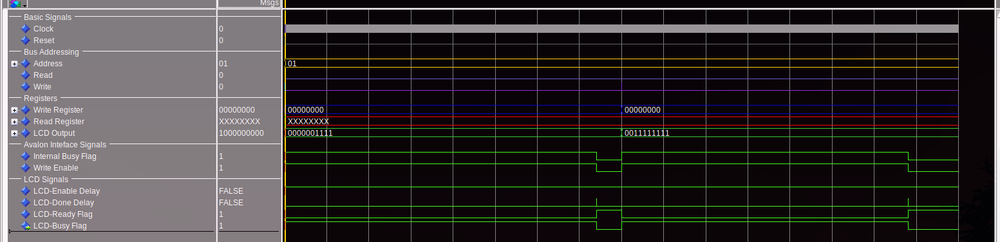

 dev
# Final Attempt at the LCD Controller in VHDL

This directory contains an attempt to develop an LCD controller in VHDL. The goal was to interface with an LCD via the Avalon bus, convert the received data to 8-bit parallel signals, and manage the control lines for proper data transmission. Unfortunately, the solution does not work as intended and is being abandoned in favor of a new approach. A new branch will focus on a revised LCD interface that provides a direct pass-through from the HPS.
[see pull request #6](https://github.com/msu-eele-fpga/final-project-caleb-drew/pull/6)
 
> [!CAUTION]
> This code is provided purely for documentation purposes. It simulates and compiles correctly, but it does not function as expected. The code will be left on a deprecated branch for archival purposes if no further documentation is required.

## General Functionality

The hardware was designed to achieve the following:

- **Input**: The system receives a write command from the Avalon bus.
- **Conversion**: It converts the data to an 8-bit parallel transmission that the LCD can process.
- **Control Signals**: The system manages the LCD's enable pin for the latch cycle and sets the data bits for transmission.
- **Idle State**: After a transmission completes, the system enters an idle state, waiting for the next transmission.

In essence, this design was intended to interface an Avalon bus to an LCD through a simple latch and data transmission cycle.

## Simulation Results

The simulation mimics the Avalon bus interactions with the LCD controller and should represent the expected behavior in the final hardware platform. While the simulation works as intended, it does not port to the fabric correctly, leading to failures in actual operation.

### Initial Transmission

This screenshot demonstrates the initial transmission of the system, with all signals set correctly. The timing of the delays and the flags aligns with expectations for proper functionality.

### Full Transmission

This screenshot shows the full transmission, including multiple writes to the 8-bit bus. The system resets correctly, and multiple writes are handled properly. The `busy_flag` is asserted and cleared as expected during the transmission.

## Issues and Failures

Despite correct simulation behavior, the system encounters a critical failure during operation. Specifically, the `busy_flag` becomes stuck in either a high or low state, which prevents data from being placed on the 8-bit parallel bus. This issue does not appear in simulation but occurs when deployed on the hardware.

Unfortunately, the source of this error remains unknown, as the system behaves as expected during simulation, leading to a mismatch between simulated and actual behavior.

## Next Steps

Given the issues encountered in this design, a [new branch](https://github.com/msu-eele-fpga/final-project-caleb-drew/pull/6) will be created to focus on a revised LCD interface. This new approach will aim to provide a direct pass-through from the HPS to the LCD, simplifying the interface and resolving the issues present in this branch.
.

# Final attempt at the LCD Controller in VHDL
Attempting to solve the off by one clock cycle error resulted in code that would simulate properly, compile properly but not function properly. As such this code is being abandoned. This branch will not be continued. A new branch will be created that will focus on a new LCD interface that will provide a direct pass through from the HPS.

> [!CAUTION]
> This code and work is being provided purely for documentation purposes. It does not function and the code would be left on a depreciated branch if documentation was not required. 

## General Functionality
The hardware will take in a write from the Avalon bus and then convert that into an 8-bit parallel transmission the LCD can work with. This involves setting the enable pin for the LCD for the latch cycle, then setting the data bits and holding the data bits for another latch. 

Once the transmission is complete, the system will enter an idle state waiting for another transmission.

## Simulation results of the system as is
This simulation simulates the Avalon bus interactions with the LCD controller and should be a 1 to 1 replication of the final platform designer functionality. However, this does not port to the fabric with the expected results. The screenshots are provided for documentation purposes. 

This screenshot shows the initial transmission of the system with all proper signals. The timing of the delays and flags being set is exactly as expected for proper functionality. 

This screenshot shows the full transmission including multiple writes to the 8-bit bus. This shows the system resets properly and allows for multiple writes. The busy_flag is asserted and cleared properly. 

## Failures of the system
During operation, the busy_flag gets stuck either high or low and prevents data from being put on the 8-bit parallel bus. I don't know the source of this error as the system simulates as expected. 

